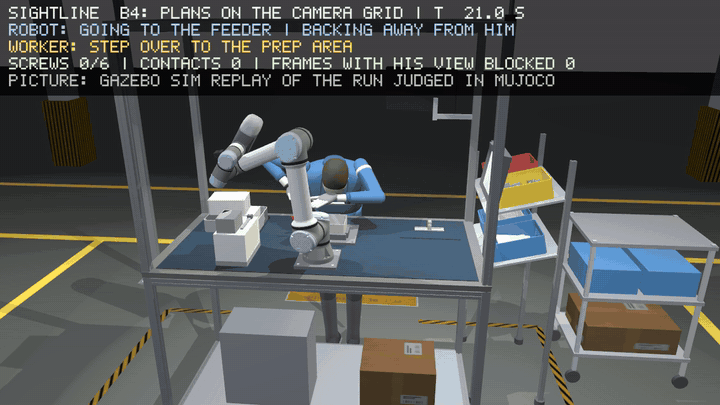

# SightLine

A UR5e that drives screws next to a person without touching them and without
getting between them and the camera that watches them. ROS 2 Lyrical, MuJoCo for
the physics, Gazebo Sim and rviz2 for looking at it. The planner comes in two
builds, Python and C++; the C++ one is what would go on a real controller.



*Twelve seconds of one cycle, rendered by Gazebo from a camera facing the worker: rail
screw 2 goes in while he clips terminal blocks next to the robot. The band at the top
is what the judge recorded. The full clip is [docs/media/B4_front_gazebo_seed0.mp4](docs/media/B4_front_gazebo_seed0.mp4);
the other views are under [releases](../../releases).*

## What it does

An overhead depth camera looks down at the bench. I treat the camera's view as a
grid of directions. Every direction in which it currently sees the person is off
limits for the arm, from the camera down to 15 cm behind them, plus a margin for the
arm's own thickness and for how far the person could move before the arm can stop.
The grid is rebuilt for every frame (25 Hz), and the arm's next moves are checked
against it at 63 points along the links every 10 ms. If a move would enter the grid
the arm brakes, backs out along its own path, or retreats to a standoff. It also
picks which screw to drive next, and from which side, based on what is clear.

The two rules are scored by a judge that reads the simulator state directly. The
planner never sees that state; it gets a noisy, one-frame-late depth image and its
own joint angles, like it would on a real cell.

1. never touch the person
2. never block the overhead camera's view of the person

## Results

One 81 s cycle, seed 0. B0 is the same controller with the rules switched off, B2 and
B3 use the usual distance dampers (B3 also dampens the sight lines), B4 is the grid.

|                                        | B0     | B2     | B3     | B4 (grid) |
|----------------------------------------|--------|--------|--------|-----------|
| screws driven                          | 6 / 6  | 4 / 6  | 4 / 6  | 6 / 6     |
| contacts the robot caused              | 5      | 5      | 8      | 0         |
| contacts the person caused             | 35     | 1      | 29     | 0         |
| deepest contact                        | 76 mm  | 60 mm  | 76 mm  | none, closest 97 mm |
| frames with the person hidden          | 10.1 % | 9.8 %  | 14.4 % | 0.0 %     |
| times it asked the person to move      | 0      | 3      | 3      | 0         |
| compute per 10 ms cycle, median        | 0.2 ms | 7.4 ms | 9.3 ms | 1.0 ms    |

B4 drives all six screws without touching the worker once and without ever putting
itself between him and the camera. Three of the six go in while he works 40 cm away
from the arm, which is what ordering the tasks around the robot's windows was for,
and the whole decision costs 1 ms of the 10 ms cycle.

Running the Python planner as two ROS 2 nodes instead of in-process gives the same
run: every body's pose matches the in-process recording over all 2023 frames, and the
planner's state and the guard's verdict were checked frame by frame over the first
6 s. One 81 s cycle in simulation, one seed; every run, every gate and the full set of
numbers are in `docs/results.md`.

## Layout

```
src/sightline_planner       the robot's own code: view grid, guard, task. Imports nothing from the sim.
src/sightline_planner_cpp   the same planner in C++ (Eigen, MuJoCo, no ROS), for the controller
src/sightline_sim           the cell in MuJoCo: station, worker, cameras, the judge, the gate scripts, Gazebo export
src/sightline_ros           cell_node and planner_node (lockstep on sim time), replay_live, the topic contract
src/sightline_ros_cpp       the C++ planner_node and the same topic contract in C++
src/sightline_bringup       launch files, rviz/Gazebo configs, UR5e xacro, recording scripts
docs/                       design.md (the spec and every change since), notes.md (model choices with sources), results.md
results/                    the numbers of every gate; videos, frames and bags are not committed
```

The planner is written twice on purpose. The Python is where the algorithms were
worked out and it is what the gate scripts run; `sightline_planner_cpp` is the same
thing in C++17 on Eigen and the MuJoCo C API, with no ROS and no simulator linked
into it, which is the shape it needs to be in for a real controller.
`sightline_ros_cpp` wraps it in the lockstep contract the Python node already
speaks, so either one drives the cell node over the same topics.

## Install

Tested on Ubuntu with ROS 2 Lyrical, Gazebo Sim 10, Python 3.14, GCC 15, a GTX 1650.

```bash
sudo apt install ros-lyrical-ros-gz-bridge ros-lyrical-ur-description ros-lyrical-xacro \
                 ros-lyrical-robot-state-publisher ros-lyrical-rviz2 \
                 libeigen3-dev nlohmann-json3-dev libyaml-cpp-dev libegl-dev
git clone https://github.com/google-deepmind/mujoco_menagerie ~/mujoco_menagerie   # UR5e model
pip install -r requirements.txt            # into the python that runs your ROS 2 nodes
pip install --no-deps sdformat-mjcf        # only needed for the Gazebo export

colcon build --symlink-install
source install/setup.bash
```

If the Menagerie checkout is somewhere else, set `MUJOCO_MENAGERIE`. Rendering is
offscreen through EGL; on a laptop with two GPUs point it at the discrete one with
`export __EGL_VENDOR_LIBRARY_FILENAMES=/usr/share/glvnd/egl_vendor.d/10_nvidia.json`,
and `MUJOCO_EGL_DEVICE_ID` picks the device for the C++ planner's own render.

The C++ packages link MuJoCo, which has no apt package. They find it through the
Python wheel, which ships the C headers and `libmujoco.so`: set `MUJOCO_DIR` to that
directory, or `SIGHTLINE_PYTHON` to a python that can import `mujoco`, before
building.

## Run

The planner live, as two nodes in lockstep on sim time (so the run is the same on a
slow machine and a fast one), with rviz and a bag:

```bash
ros2 launch sightline_bringup stage1.launch.py seed:=0 seconds:=full rviz:=true bag:=true
```

`planner:=cpp` swaps in the C++ planner. It plans on a model loaded from a file
rather than one built in process, so the launch writes the model out first with
`station.export_robot_mjcf`; it is the same model `robot_only_model` builds. The
numbers above are the Python planner's. The C++ port matches it piece by piece and
its render to four decimal places, but it has not yet been run against it over a
whole cycle; the three places the two are allowed to differ are in `docs/notes.md`.

```bash
ros2 launch sightline_bringup stage1.launch.py planner:=cpp
```

Results go to `results/ros2/stage1/`: the judge's numbers, the planner's numbers,
every body's pose at 25 Hz, the bag. rviz shows the UR5e on the joint states, the
worker as the judge's capsules, and the planner's grid as point clouds (red where
the camera sees the person, orange for cells the arm hides and the planner keeps for
half a second, dark red the far end 15 cm behind them).

Gazebo rendering of a recorded run:

```bash
python -c "from sightline_sim.station import export_mjcf; export_mjcf('results/ros2/scene')"
ros2 run sightline_sim mjcf_to_sdf results/ros2/scene/sightline_cell.xml results/ros2/gazebo/sightline_cell.sdf
ros2 run sightline_sim make_replay_world results/ros2/scene/sightline_cell.xml \
    results/ros2/gazebo/sightline_cell.sdf results/ros2/gazebo/sightline_replay.sdf --shadows --gui-camera front

GZ_PARTITION=sightline gz sim -s --headless-rendering results/ros2/gazebo/sightline_replay.sdf &
GZ_PARTITION=sightline ros2 run sightline_sim replay_gazebo results/ros2/stage1/run_B4_seed0_poses.npz \
    results/ros2/gazebo/frames --cameras front cycle_hero eyes_cam
ros2 run sightline_sim assemble_video results/ros2/stage1/run_B4_seed0_poses.npz results/ros2/gazebo/frames results/ros2/gazebo
```

Or live, with the Gazebo GUI and rviz open:

```bash
ros2 launch sightline_bringup replay.launch.py poses:=results/ros2/stage1/run_B4_seed0_poses.npz gui:=true rviz:=true
```

The gate scripts that produced the numbers in `results/` run one at a time from the
workspace root, e.g. `ros2 run sightline_sim gate5_planner results/gate5 0 B4 --video`.
Tests are plain unittest: `python -m unittest discover -s src/sightline_sim/test`
(and the same for `sightline_planner` and `sightline_ros`, the last one with ROS
sourced). The C++ side has gtest cases: `colcon test --packages-select sightline_planner_cpp`.

## What's next

- Held-out seeds, and a search for the camera mount that includes the cell's
  aluminium frame rather than only the pole.
- Perception is 137 ms per frame against the camera's 40 ms. The lockstep hides that
  in simulation; getting it under budget, or one frame behind, is the last piece
  before this drives real hardware.
- A physical UR5e cell built from the parts list in `docs/notes.md`.

Every model choice, and whether it comes from a datasheet, a standard, a published
range or my own judgement, is listed with its source in `docs/notes.md`. Every bug
found and the test that now catches it is in `CHANGELOG.md`.

MIT licence.
